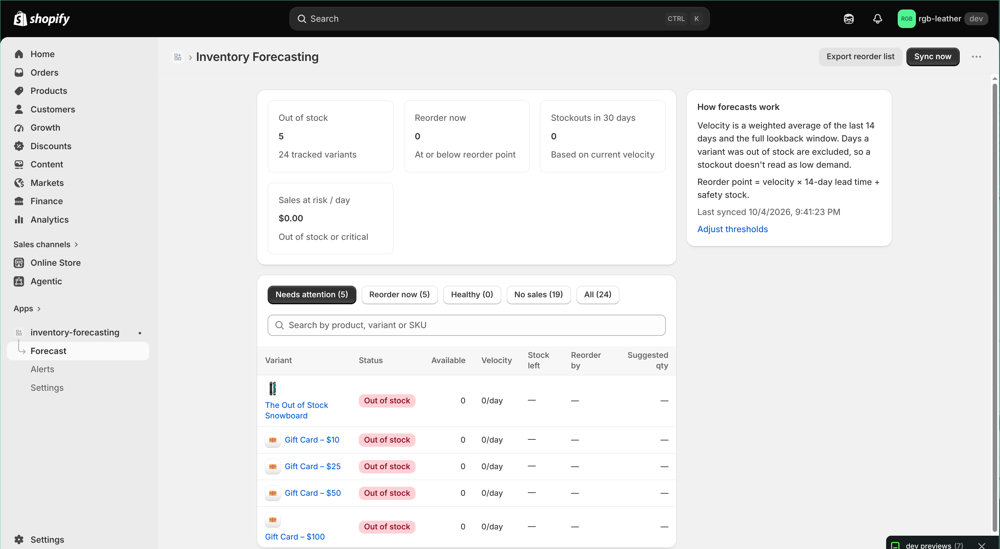
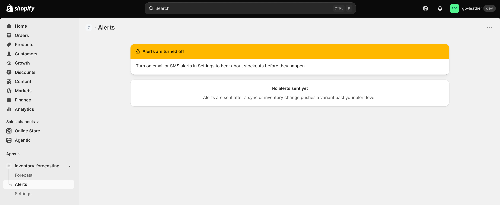
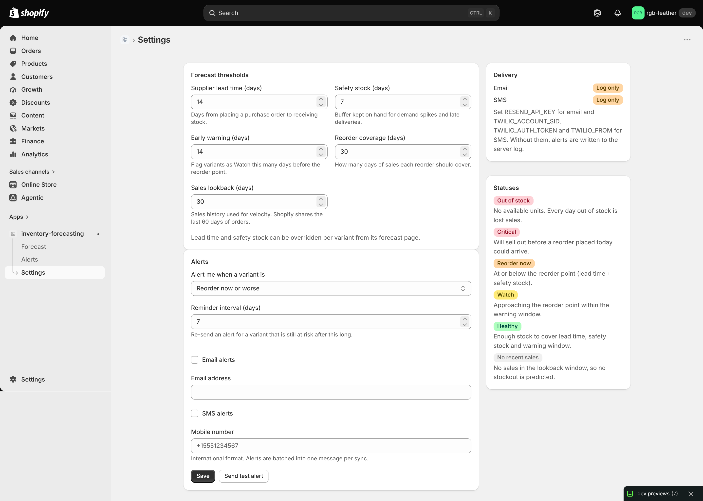

# Inventory Forecasting

An embedded Shopify app that predicts when each product variant will run out of
stock and alerts the merchant by email or SMS before it happens.



## What it does

Running out of a best-seller means lost sales; over-ordering ties up cash. The
app pulls each tracked variant's stock level and recent orders from Shopify,
works out how fast it sells, and tells you:

- how many days of stock are left and the date it will sell out
- the date you need to place a reorder, given your supplier's lead time
- how many units to order to cover the next few weeks

Forecasts update automatically when inventory changes, and an optional daily
sync keeps every shop current.

## How to use it

1. **Install** the app on your store and open it from **Apps → Inventory Forecasting**.
2. **Make sure inventory tracking is on** for the products you want forecast
   (Products → variant → *Track quantity*). Untracked variants are skipped.
3. Click **Sync now**. The app imports your stock and up to 60 days of orders,
   then ranks every variant by urgency.
4. **Review the Forecast page.** Start with *Needs attention*, then click a
   variant to see its stock chart, sales history and the math behind it.
5. **Tune Settings** to match your business: supplier lead time, safety stock,
   warning window and how many days each reorder should cover. Lead time and
   safety stock can also be overridden per variant.
6. **Turn on alerts.** In Settings, add an email address or mobile number, pick
   the alert level and click *Send test alert*. Past alerts appear on the
   **Alerts** page.
7. **Reorder.** Click *Export reorder list* for a CSV of what to buy and how much.

## Features

- **Forecast** — KPIs (out of stock, reorder now, stockouts in 30 days, sales at
  risk), variants ranked by urgency, filters, search and a CSV reorder list
- **Variant detail** — stock history with projected stockout, daily sales, and
  per-variant lead time and safety stock
- **Alerts** — one email/SMS digest per sync, deduplicated so a variant is only
  re-alerted when it gets worse or after a reminder interval
- **Settings** — lead time, safety stock, warning window, reorder coverage,
  lookback and alert level

## How the forecast works

- **Sales rate** = 60% last 14 days + 40% full lookback, skipping days the
  variant was out of stock so a stockout doesn't read as low demand
- **Reorder point** = sales rate × lead time + safety stock
- **Suggested qty** = sales rate × (lead time + coverage) + safety stock − available
- **Statuses:** Out of stock → Critical → Reorder now → Watch → Healthy, plus
  No recent sales

## Screenshots

| Alerts | Settings |
| --- | --- |
|  |  |

## Tech stack

React Router · Shopify Admin GraphQL API (2026-07) · Polaris web components ·
Prisma + SQLite · webhooks for inventory updates · read-only scopes
(`read_products`, `read_inventory`, `read_orders`)

## Run locally

```shell
npm install
npm run setup
npm run dev
```

Optional environment variables:

| Variable | Purpose |
| --- | --- |
| `RESEND_API_KEY`, `EMAIL_FROM` | Email alerts (logged when unset) |
| `TWILIO_ACCOUNT_SID`, `TWILIO_AUTH_TOKEN`, `TWILIO_FROM` | SMS alerts (logged when unset) |
| `CRON_SECRET` | Enables `POST /jobs/sync` for a daily re-forecast of every shop |

> Order webhooks are disabled in `shopify.app.toml` until protected customer
> data access is approved. Orders are still picked up on each sync.
